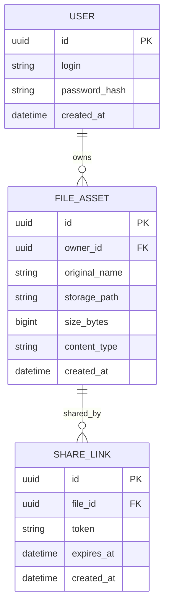

# Modele de donnees

## Contexte

Le prototype couvre le socle d'authentification JWT et le cycle fichier (upload, download, partage, suppression).

Le present document distingue :
- le **modele logique cible** pour une base de donnees relationnelle, documente mais pas encore implemente comme modele metier principal,
- et l'**implementation actuelle** du prototype, qui stocke encore les metadonnees localement sur disque.

## Donnees techniques actuelles

### DemoUser (configuration)

Source: `application.yml`

- `login`
- `password` (format Spring Security, ex. `{noop}demo123`)

Ce n'est pas une entite de base de donnees.

### JWT Claims

Generees par `JwtService`:

- `sub` : login utilisateur
- `iat` : date d'emission
- `exp` : date d'expiration

## MCD cible

Le modele cible pour la persistance metier est compose de 3 entites : `User`, `FileAsset` et `ShareLink`.

## Description des entites

### User

Represente un compte applicatif authentifie.

- `id` (UUID)
- `login` ou `email`
- `password_hash`
- `created_at`

### FileAsset

Represente un fichier televerse et rattache a son proprietaire.

- `id` (UUID)
- `owner_id` (FK -> User)
- `original_name`
- `storage_path`
- `size_bytes`
- `content_type`
- `created_at`

### ShareLink

Represente un lien de partage temporaire associe a un fichier.

- `id` (UUID)
- `file_id` (FK -> FileAsset)
- `token`
- `expires_at`
- `created_at`

## Regles de gestion

- Un `User` peut posseder plusieurs `FileAsset`.
- Un `FileAsset` appartient a un seul `User`.
- Un `FileAsset` peut avoir plusieurs `ShareLink`.
- Un `ShareLink` reference un seul `FileAsset`.
- La suppression d'un `FileAsset` doit invalider/supprimer ses `ShareLink`.

## Tables relationnelles conseillees

Si le prototype est aligne sur ce MCD, la base relationnelle doit contenir :

### `users`

- `id` UUID, PK
- `login` VARCHAR, unique
- `password_hash` VARCHAR
- `created_at` TIMESTAMP

### `file_assets`

- `id` UUID, PK
- `owner_id` UUID, FK -> `users.id`
- `original_name` VARCHAR
- `storage_path` VARCHAR
- `size_bytes` BIGINT
- `content_type` VARCHAR
- `created_at` TIMESTAMP

### `share_links`

- `id` UUID, PK
- `file_id` UUID, FK -> `file_assets.id`
- `token` VARCHAR, unique
- `expires_at` TIMESTAMP
- `created_at` TIMESTAMP

## Note d'architecture

Ce document complete `docs/architecture.md` et le contrat `docs/openapi.yaml`.

Dans l'etat actuel du prototype, les fichiers sont stockes localement et les metadonnees sont persistées sous forme de fichiers internes. Le MCD ci-dessus represente le **modele cible documente** attendu pour une persistance relationnelle propre, et non le modele encore implemente au coeur du prototype.

